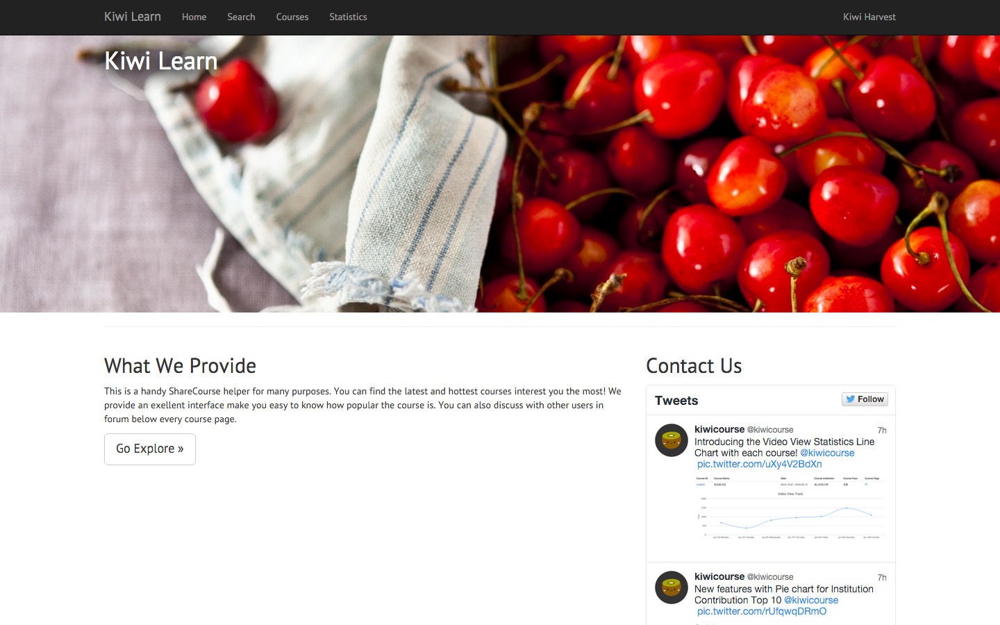
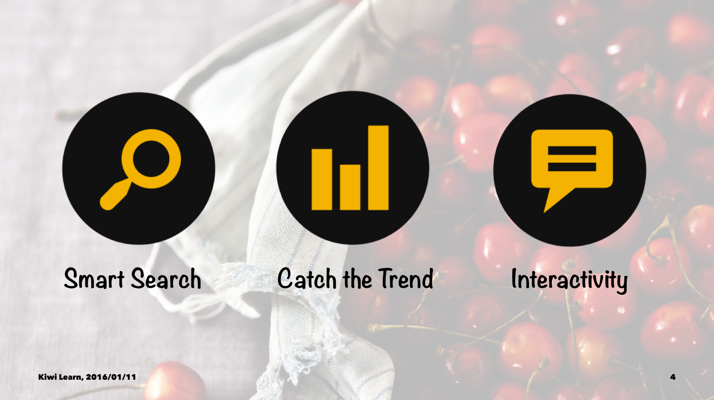
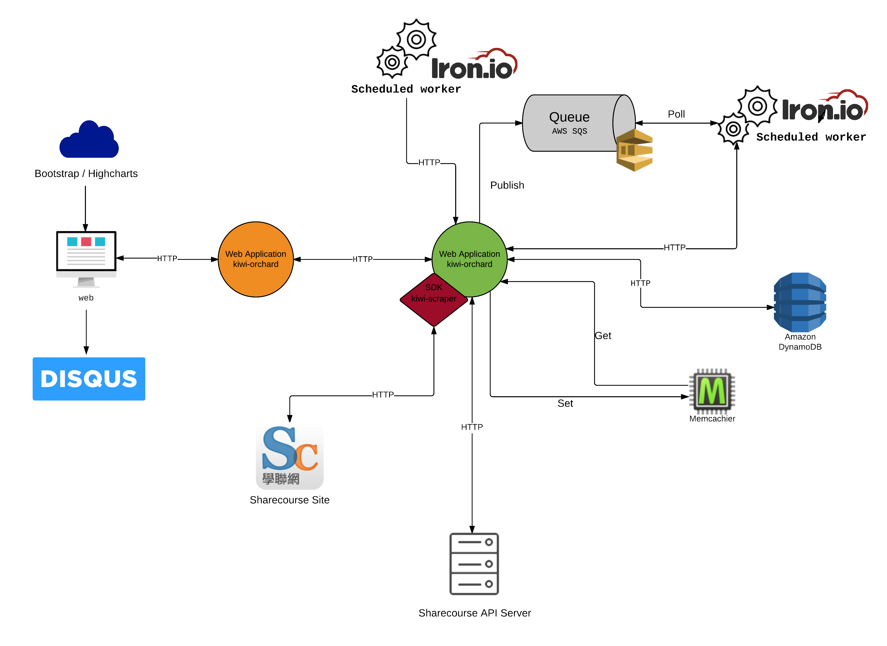

slidenumbers: true
footer: Kiwi Learn, 2016/01/11

# Kiwi Learn

---

# Outline

- Demonstration
- Core Features
- Services What We Use
- Architecture

---

---

<!--  -->
<!-- - Smart Courses Explore
- Catch the Courses Trend
- Students Interactivity -->

---

# Services We Use

- Two separate dynos on **Heroku**
- Comment hosting on **Disqus**
- One table on **AWS DynamoDB**
- One Queue on **AWS SQS**
- Two workers on **IronWorker**
- One cache on **Memcachier**

---

---

# Demonstration
