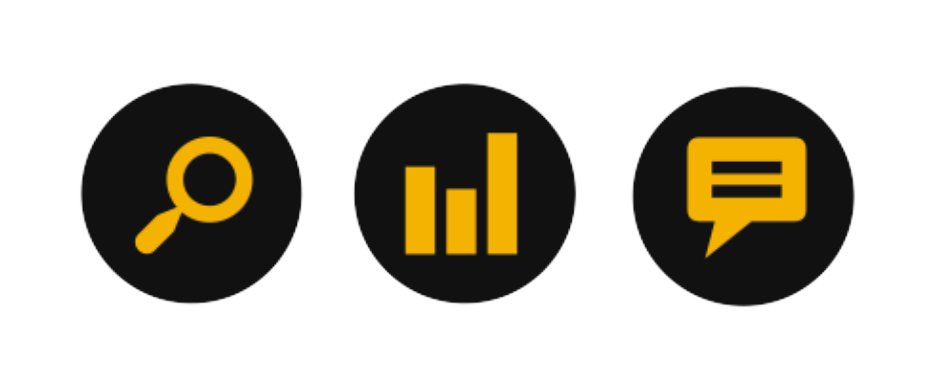

slidenumbers: true
footer: Kiwi Learn, 2016/01/11

# Kiwi Learn

---

# Outline

- Demonstration
- Core Features
- Services What We Use
- Architecture

---

# Demonstration

---

# Core Features

- Smart Courses Explore
- Catch the Courses Trend
- Students Interactivity

---

# Services What We Use

- Two separate dynos on Heroku
- Comment hosting on Disqus
- One table on AWS DynamoDB
- One Queue on AWS SQS
- Two workers on IronWorker
- One cache on Memcachier

---

